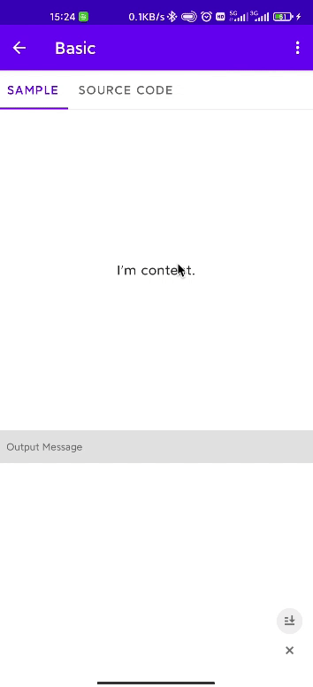

[English](README.md) | **简体中文**

# StateLayout


:cyclone: 一个 Android 上的自定义多状态布局。

# 预览


下载示例 APK 查看更多: [Sample APK](sample.apk).

# 特点
- 使用简单
- 高扩展性
- API 设计合理
- 支持状态切换动画
- 支持设置全局状态
- 支持根据网络状态、列表数据等场景自动切换状态
- 支持懒加载，仅当切换到对应状态时才会去填充布局

# 接入
添加 `statelayout` 依赖到你的库或 APP 项目的 `build.gradle` 文件:
```groovy
dependencies {
  implementation 'com.airsaid:statelayout:$version'
}
```

# 使用
1. 实现 `State` 和 `StateProvider` 接口来提供各种状态。例如:
```kotlin
import com.airsaid.statelayout.State

class LoadingState : State {

  override fun getLayoutId() = R.layout.state_loading

  override fun onFinishInflate(stateView: View) {}
}
```
```kotlin
import com.airsaid.statelayout.StateProvider

class CommonStateProvider : StateProvider {
  override fun getStates(): MutableList<State> {
    return mutableListOf(EmptyState(), ErrorState(), LoadingState())
  }
}
```

2. 添加 `StateLayout` 到 XML 布局中。例如:
```xml
<com.airsaid.statelayout.StateLayout
    android:id="@+id/stateLayout"
    android:layout_width="match_parent" 
    android:layout_height="match_parent">

    <!-- 内容布局 -->
    <FrameLayout 
        android:layout_width="match_parent" 
        android:layout_height="match_parent">

        <TextView 
            android:layout_width="wrap_content" 
            android:layout_height="wrap_content"
            android:layout_gravity="center" 
            android:text="I'am content." />
    </FrameLayout>
</com.airsaid.statelayout.StateLayout>
```

3. 在代码中调用 `initStateProvider()` 方法来提供支持的状态。例如:
```kotlin
stateLayout.initStateProvider(CommonStateProvider())
```
**或者，如果不希望在每次使用前都进行设置，则可以通过调用 `StateLayout.setGlobalStateProvider()` 静态方法来提供全局的状态**。例如:
```kotlin
class App : Application() {
  override fun onCreate() {
    super.onCreate()
    StateLayout.setGlobalStateProvider(CommonStateProvider())
  }
}
```

4. 调用 `showContent()` 或 `showState()` 方法来切换不同的状态。例如:
```kotlin
stateLayout.showContent()
stateLayout.showState(LoadingState::class.java)
stateLayout.showState(EmptyState::class.java)
```

# 过渡动画
你可以通过调用 `setTransitionAnimator()` 方法来设置状态间切换的过渡动画。

目前自带的过渡动画有:
- AlphaTransitionAnimator (默认的)
- TranslationTransitionAnimator
- AlphaTranslationTransitionAnimator

# 监听状态的切换
你可以通过调用 `addStateChangedListener()` 方法来添加状态改变的监听。例如:
```kotlin
stateLayout.addStateChangedListener { state, isShow ->
  Log.d(TAG, "onStateChanged state: $state, isShow: $isShow")
}
```

# 自动切换状态
`StateLayout` 提供了 `addStateTrigger()` 方法，可以实现在满足条件的情况下自动切换状态。例如下面这个 `RecyclerViewStateTrigger` 就实现了在空数据时自动切换到空状态布局:

<details>
<summary>RecyclerViewStateTrigger</summary>

```kotlin
/**
 * A state trigger sample that passes in the specified [adapter] object for observation
 * and automatically sets the empty data state when the data size is 0,
 * and the content state when there is data.
 *
 * @property adapter The [RecyclerView.Adapter] object being watched.
 * @author airsaid
 */
class RecyclerViewStateTrigger(
    private val adapter: RecyclerView.Adapter<*>,
) : StateTrigger<Int>() {

  private val adapterDataObserver by lazy {
    StateAdapterDataObserver(this, adapter)
  }

  override fun onTrigger(stateLayout: StateLayout, count: Int) {
    if (count != 0) {
      stateLayout.showContent()
    } else {
      stateLayout.showState(EmptyState::class.java)
    }
  }

  override fun onAttachedToWindow() {
    adapter.registerAdapterDataObserver(adapterDataObserver)
  }

  override fun onDetachedFromWindow() {
    adapter.unregisterAdapterDataObserver(adapterDataObserver)
  }

  private class StateAdapterDataObserver(
      private val stateTrigger: StateTrigger<Int>,
      private val adapter: RecyclerView.Adapter<*>
  ) : RecyclerView.AdapterDataObserver() {
    override fun onChanged() {
      super.onChanged()
      dataChanged()
    }

    override fun onItemRangeRemoved(positionStart: Int, itemCount: Int) {
      super.onItemRangeRemoved(positionStart, itemCount)
      dataChanged()
    }

    override fun onItemRangeInserted(positionStart: Int, itemCount: Int) {
      super.onItemRangeInserted(positionStart, itemCount)
      dataChanged()
    }

    override fun onItemRangeChanged(positionStart: Int, itemCount: Int) {
      super.onItemRangeChanged(positionStart, itemCount)
      dataChanged()
    }

    override fun onItemRangeChanged(positionStart: Int, itemCount: Int, payload: Any?) {
      super.onItemRangeChanged(positionStart, itemCount, payload)
      dataChanged()
    }

    private fun dataChanged() {
      stateTrigger.trigger(adapter.itemCount)
    }
  }
}
```

除此之外，实例代码中还提供了 `NetworkStateTrigger`。或者你也可以实现 `StateTrigger` 接口来实现自己的逻辑。

</details>

使用时只需要调用 `addStateTrigger()` 方法（可以添加多个触发器）。例如:
```kotlin
stateLayout.addStateTrigger(RecyclerViewStateTrigger(sampleAdapter))
```

# 设置指定状态的点击事件和样式
在 `onFinishInflate()` 回调中可以获取到该状态布局的 `View`，然后可以设置点击事件或执行其他操作。例如:
```kotlin
class ErrorState : State {
  private lateinit var listener: View.OnClickListener

  override fun getLayoutId() = R.layout.state_error

  override fun onFinishInflate(stateView: View) {
    stateView.findViewById<Button>(R.id.reload).setOnClickListener(listener)
  }

  fun setOnReloadListener(listener: View.OnClickListener) {
    this.listener = listener
  }
}
```
```kotlin
stateLayout.getState<ErrorState>(ErrorState::class.java).setOnReloadListener {
  // do something...
}
```

# License
```
Copyright 2021 Airsaid. https://github.com/airsaid

Licensed under the Apache License, Version 2.0 (the "License");
you may not use this file except in compliance with the License.
You may obtain a copy of the License at

   http://www.apache.org/licenses/LICENSE-2.0

Unless required by applicable law or agreed to in writing, software
distributed under the License is distributed on an "AS IS" BASIS,
WITHOUT WARRANTIES OR CONDITIONS OF ANY KIND, either express or implied.
See the License for the specific language governing permissions and
limitations under the License.
```
